# Операционные системы UNIX/Linux

## Part1 Установка ОС
Скачиваем программу для виртуализации - VirtualBox для Windows.

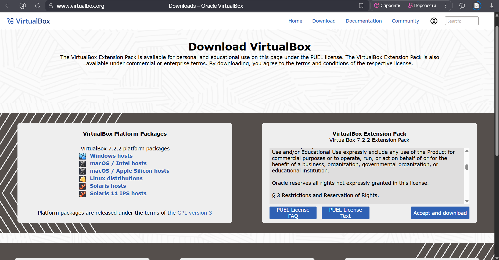

Скачиваем Ubuntu Server без графичческого интерфейса с сайта.


Выделяем память под Ubuntu.


Запускаем виртуальную машину.

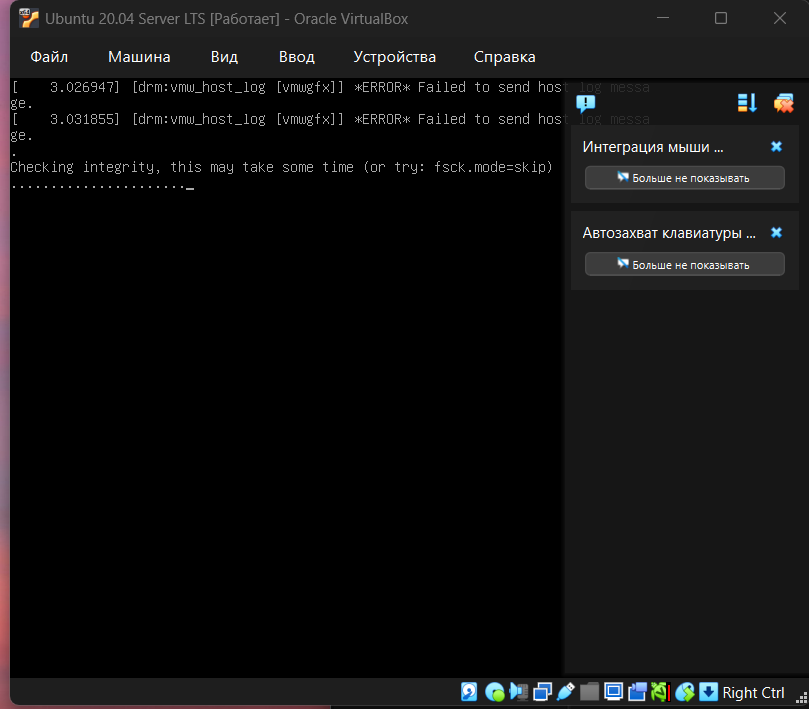

Выполняем команду ```cat /etc/issue```, которая показывает информацию о версии ОС.

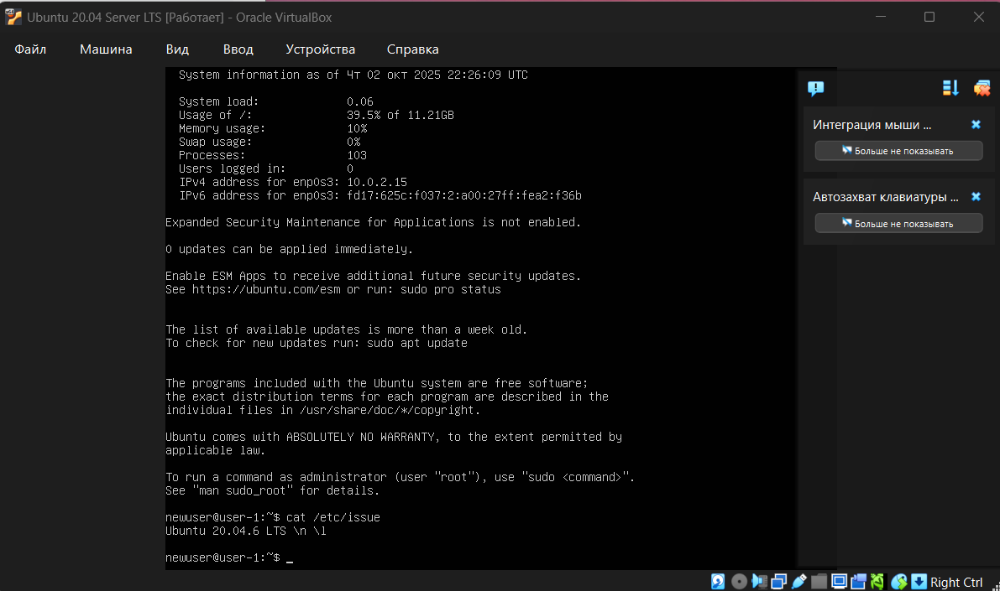


## Part2 Создание пользователя
Создаем нового пользователя cat1.


Добавляем в группу adm командой ```sudo usermod -aG adm cat1```


Выполняем команду ```cat /etc/passwd```


Убедились, что cat1 действительно есть в adm


## Part 3 Настройка сети ОС

Меняем имя хоста на user-1.


Смотрим, какая установлена временная зона.


Смотрим список доступных временных зон.


Меняем зону и проверяем замену.


Выполняем команду ```ip a``` для вывода названий сетевых интерфейсов.


lo (loopback) – виртуальный сетевой интерфейс, присутствующий по умолчанию в любом Linux. Это "замкнутый на себя" сетевой интерфейс, который позволяет компьютеру общаться с самим собой через сетевой стек, как если бы это было сетевое соединение с другим компьютером. Он используется для отладки сетевых программ и запуска серверных приложений на локальной машине. С этим интерфейсом всегда связан адрес 127.0.0.1. У него есть dns-имя – localhost.
Адрес 127.0.0.1 (IPv4) и ::1 (IPv6) всегда указывают на сам компьютер
Позволяет запускать серверные приложения и подключаться к ним с того же компьютера.
Службы, работающие только на 127.0.0.1, недоступны из внешней сети, тем самым это защищает чувствительные приложения от внешнего доступа.
Loopback интерфейс создается автоматически ядром Linux при загрузке потому что:
-он необходим для корректной работы сетевого стека
-многие системные процессы и приложения зависят от него
-это фундаментальная часть сетевой архитектуры UNIX-систем

Используя консольную команду, получили ip адрес устройства, на котором мы работаем, от DHCP-сервера.


DHCP - Dinamic Host Configuration Protocol - Протокол динамической настройки хоста

Узнаем внешний IP-адрес шлюза


Узнаем внутренний ip-адрес шлюза
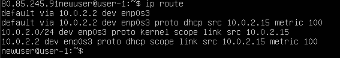

Выполняем ```sudo nano /etc/netplan/01-netcfg.yaml```


Отредактировали - задали статичные настройки ip, gw, dns


```sudo reboot``` - перезагружаем систему.

Проверяем, что ip поменялись.


Проверяем DNS


Пингуем 


## Part 4 Обновление ОС

Обновляем ОС


```sudo apt update```

```sudo apt upgrade```

Проверяем, что все обновлено до последней версии


## Part 5 Использование команды **sudo**

Даем пользователю cat1 права пользоваться sudo


sudo (англ. Substitute User and do, дословно «подменить пользователя и выполнить») - это программа для системного администрирования UNIX-систем, позволяющая пользователям выполнять команды с привилегиями другого пользователя, обычно суперпользователя (root), в соответствии с настройками безопасности, определенными в файле /etc/sudoers.

```sudo hostnamectl set-hostname cat2```

```sudo nano /etc/hosts```

```127.0.1.1   cat2```

Убеждаемся, что изменили имя хоста


## Part 6 Установка и настройка службы времени

Устанавливаем зону Europe/Moscow

```sudo timedatectl set-timezone Europe/Moscow``` - 

Настраиваем службу автоматической синхронизации времени через NTP: 

```sudo timedatectl set-ntp true```

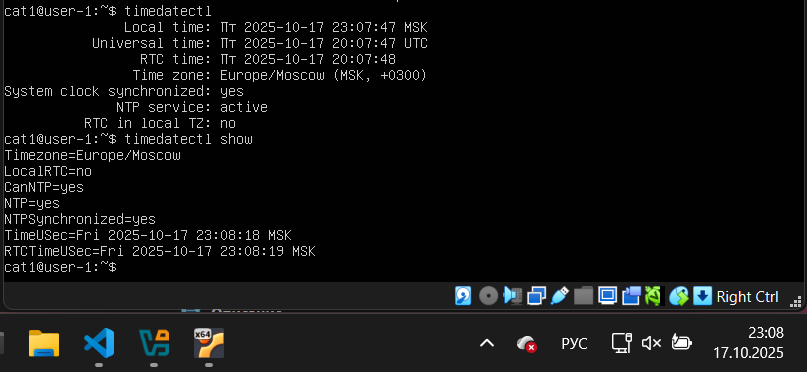


## Part 7 Установка и использование текстовых редакторов 

VIM nano уже установлены 


```sudo apt install vim mc```


### Создание файлов

```vim test_vim.txt``` - создаем новый файл с vim
esc - выйти из режима редактирования
:wq - сохранить написанное и выйти из vim

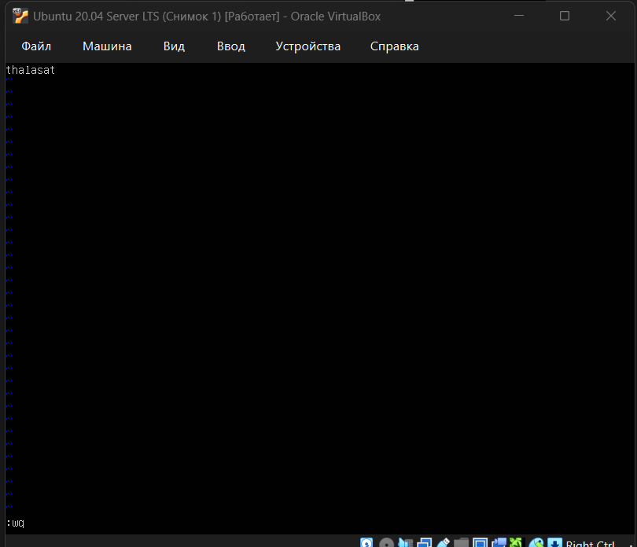

```nano test_nano.txt``` - создаем новый файл с nano

Ctrl+O - сохранить
Ctrl+X - выйти


```mc test_mcedit.txt```
написать что то Fn+F2
выбрать 1
чтобы выйти Fn+F10


Убеждаемся, что все файлы созданы и в каждом записано thalasat

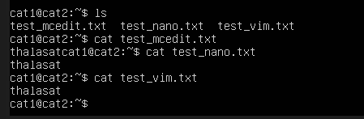

### Изменение без сохранения 

VIM

```vim test_vim.txt```
нажимаем i чтобы войти в режим вставки


редактируем файл

нажимем esc

```:q!``` - выход без сохранения

 -содержимое не поменялось
NANO

```nano test_nano.txt```

редактируем содержимое test_nano.txt
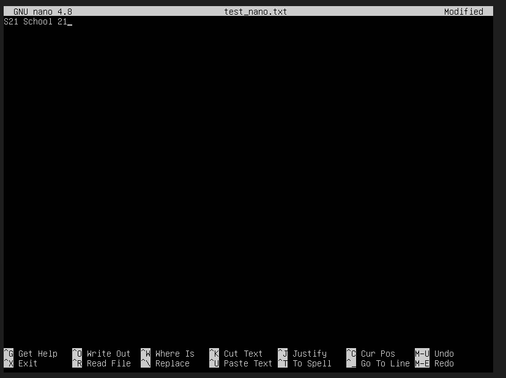

нажимаем CTRL+X, N - выходим без сохранения

 - содержимое не поменялось

MCEDIT
```mcedit test_mcedit.txt```

 - редактируем файл

Fn+F10

 - выходим без сохранения

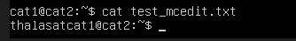 - содержимое не поменялось

### Поиск слова

VIM

Заменяем в vim thalasat на cat с командой ```s/<find_text>/<replace_text>```
выходим с :wq

 

/ - это команда для поиска

 

NANO

ctrl+W 
Ищем вхождения thal

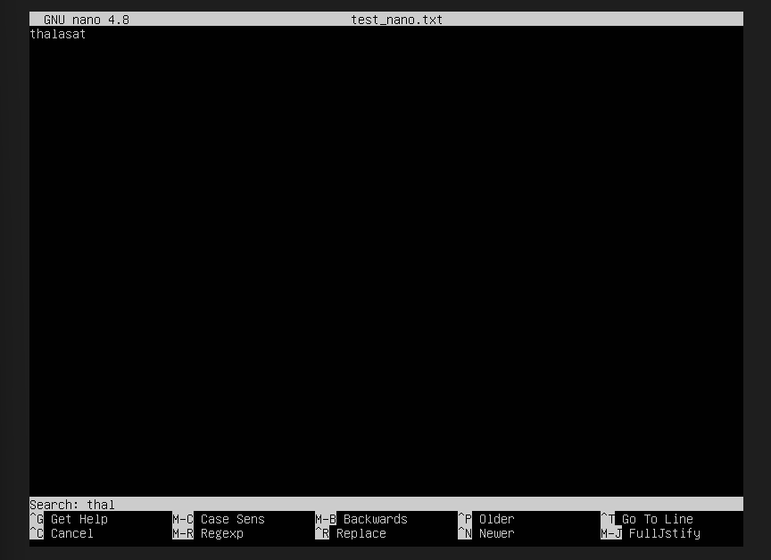

nano нашел одно вхождение


ctrl + \ - открываем режим замены
меняем thal в файле на cat


Нажимаем Y


MCEDIT
Fn+F7
Ищем sat

 

Fn+F4
Заменяем sat на cat
Дважды Enter - подтверждаем замену


Убеждаемся, что замена успешно проведена во всех файлах

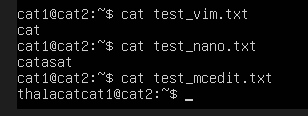


## Part 8 Установка и базовая настройка сервиса **SSHD**

Устанавливаем службу SSHd.
```sudo apt update```
```sudo apt install ssh```
```sudo apt install openssh-server```

Автостарт службы при загрузке системы
```sudo systemctl enable ssh```

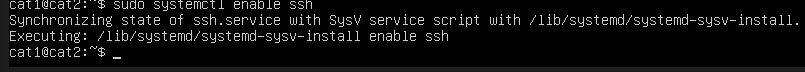

Редактируем файл ```sudo vim /etc/ssh/sshd_config```
Тем самым перенастраиваем службу SSHd на порт 2022.


Перезапускаем ssh - службу
```sudo systemctl restart ssh```

Убеждаемся, что процесс запущен

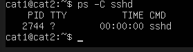

Команда ps (process ststus) - утилита для отображения информации о процессах запущенных в системе.

Ключ -C - фильтрует процессы по имени команды, показывая только процессы с указанным именем (в данном случае sshd)

Перезагружаем систему ```sudo reboot```

Смотрим сетевые соединения и порты.


- t - отображает только TCP
- a - показывает все прослушивающие порты и активные соединения
- n (numeric) - показывает числовые адреса вместо разрешения хостов и портов

## Part 9 Установка и использование утилит **top**, **htop**

```top```


  - uptime - 10;
  - количество авторизованных пользователей - 1;
  - среднюю загрузку системы - 0.00, 0.04, 0.05;
  - общее количество процессов - 96;
  - загрузку cpu - 0.0 us, 0.0 sy, 0.0 ni, 100.0 id, 0.0 wa, 0.0 hi, 0.0 si, 0.0, st
  - загрузку памяти 1971.6 total, 1492.5 free, 148.8 used, 330.3 buff/cashe
  - pid процесса занимающего больше всего памяти - 1
  - pid процесса, занимающего больше всего процессорного времени - 1
- В отчёт вставь скрин с выводом команды htop:
  - отсортированному по PID, PERCENT_CPU, PERCENT_MEM, TIME;
  - отфильтрованному для процесса sshd;
  - с процессом syslog, найденным, используя поиск;
  - с добавленным выводом hostname, clock и uptime.

```htop```


Нажимаем F6 и выбираем нужный вариант сортировки
Отсортированный по PID:
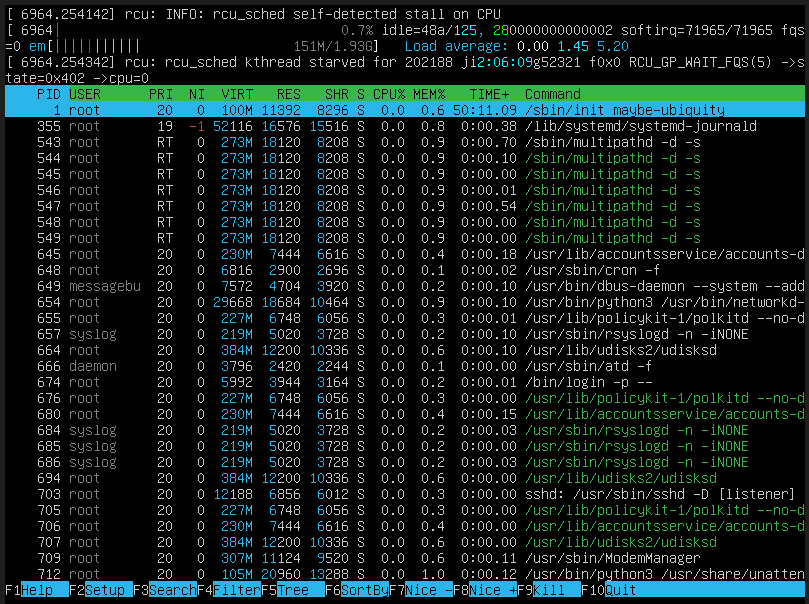
Отсортирванный по PERCENT_CPU:

Отсортирванный по PERCENT_MEM:

Отсортирванный по TIME:
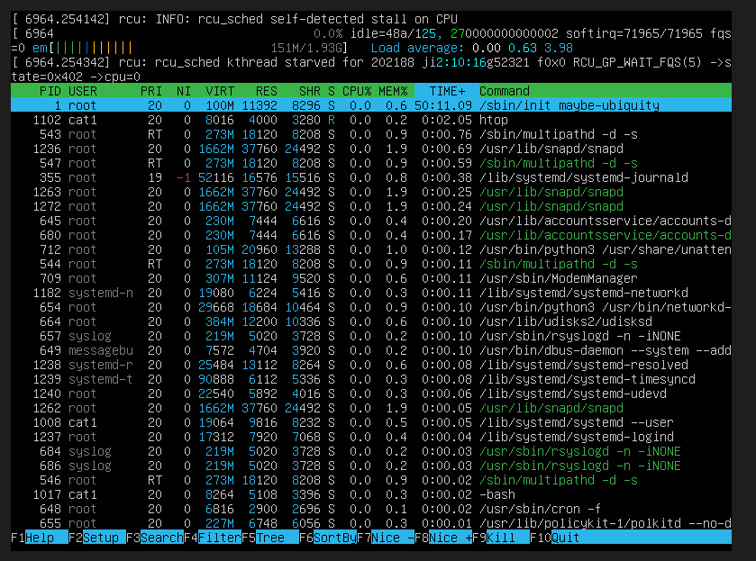
Нажимаем F4

Отфильтрованный для процесса sshd:

С процессом syslog, найденным, используя поиск
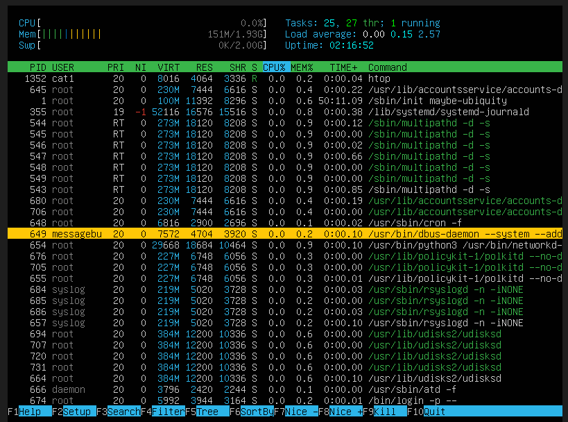
С добавленным выводом hostname, clock и uptime


## Part 10 Использование утилиты **fdisk**

```sudo fdisk -l```

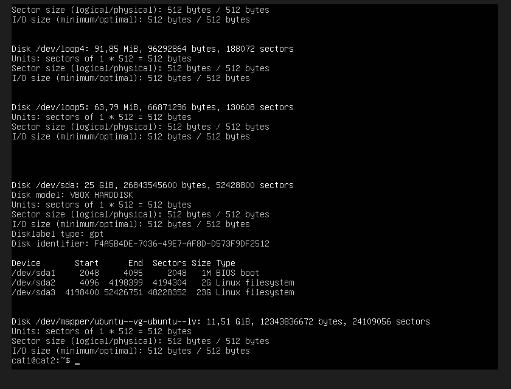

Название диска: /dev/sda

Размер диска: 25 GiB (26 843 545 600 bytes)

Количество секторов: 52 428 800 секторов

```free -h ```


Swap: 2.0 GiB total (полностью свободен)

# Part 11 Использование утилиты **df** 

```df```


  - размер занятого пространства - 11758760
  - размер свободного пространства - 6072996
  - процент использования - 46%

Единица измерения - 1K-блоки (блоки по 1024 байта)

```df -h```


    - размер раздела - 12G
    - размер занятого пространства - 4,9G
    - размер свободного пространства - 5,8G
    - процент использования - 46%
Файловая система ext4


## Part 12. Использование утилиты **du**

Запускаем ```du```

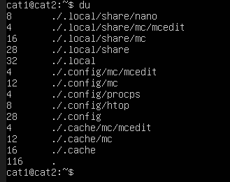

Выводим размер папок /home, /var, /var/log (в байтах, в человекочитаемом виде)


Выводим размер всего содержимого в /var/log

```sudo du -h var/log/*```

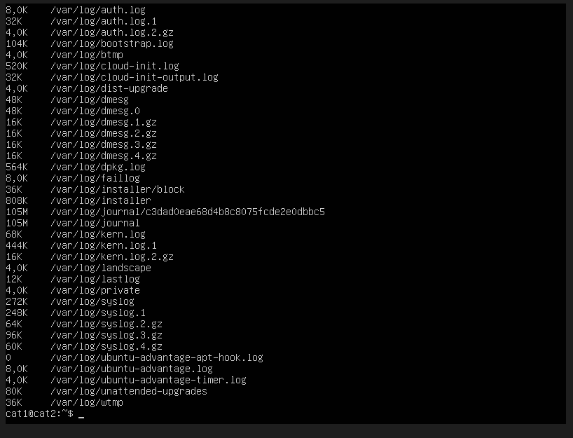

## Part 13. Установка и использование утилиты **ncdu**

```sudo apt install ncdu```

q - для выхода

```ncdu /var/log```

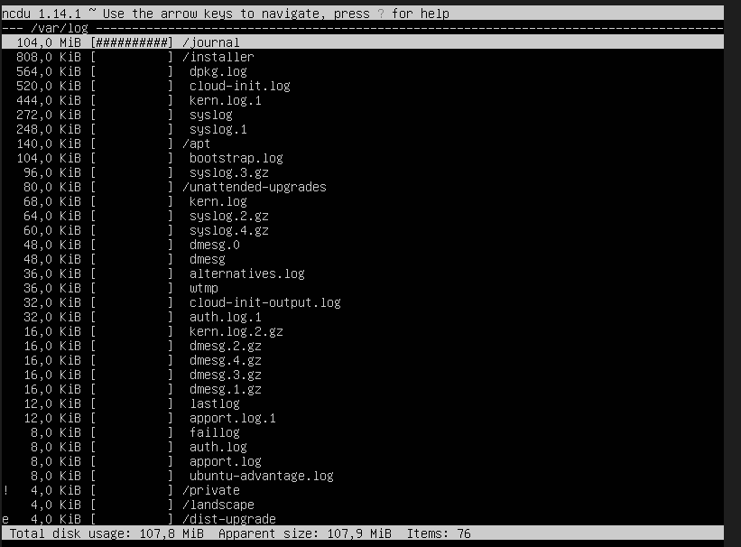

```ncdu /var```


```ncdu /home```


## Part 14. Работа с системными журналами

```vim /var/log/dmesg```


```vim /var/log/syslog```


```vim /var/auth.log```


Последняя успешная авторизация в 20:48:55, пользователь cat2,
метод входа в систему pam_unix

Перезапускаем службу sshd

```sudo systemctl restart ssh```

В логах ищем сообщение о рестарте службы


## Part 15. Использование планировщика заданий **CRON**

```crontab -e```

Редактируем планировщик задач: добавляем ```*/2 * * * * uptime```

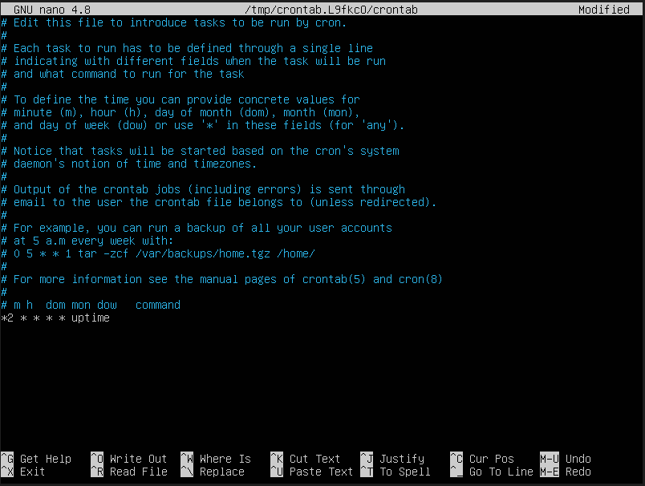


```cat var/log/syslog | grep CRON```


```crotab -l``` - смотрим текущие cron-задачи


Удаление из планировщика всех заданий и проврка, что все действительно удалено


